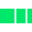

[View boilerplate demo](https://aksellsor.github.io/boilerplate/)

## Global css
`<link rel="stylesheet" href="https://aksellsor.github.io/global/global.css">`

## Favicon

`<!-- FAVICONS -->
    <link rel="apple-touch-icon" sizes="180x180"
        href="https://aksellsor.github.io/global/favicons/apple-touch-icon.png" />
    <link rel="icon" type="image/png" sizes="32x32"
        href="https://aksellsor.github.io/global/favicons/favicon-32x32.png" />
    <link rel="icon" type="image/png" sizes="16x16"
        href="https://aksellsor.github.io/global/favicons" />
    <link rel="manifest" href="https://aksellsor.github.io/global/favicons/site.webmanifest" />
    <link rel="mask-icon" href="https://aksellsor.github.io/global/favicons/safari-pinned-tab.svg"
        color="#00c458" />`
        
## SVG symbol
* As svg: 
  `<svg xmlns:xlink="http://www.w3.org/1999/xlink" xmlns="http://www.w3.org/2000/svg" width="61.703" height="28.047"
    viewBox="0 0 61.703 28.047" style="margin-bottom:2rem;">
    <g id="Group_88159" data-name="Group 88159" transform="translate(-608.5 -2468.587)">
      <rect id="Rectangle_65" data-name="Rectangle 65" width="28.047" height="28.047"
        transform="translate(608.5 2468.587)" fill="#00e86a"></rect>
      <rect id="Rectangle_66" data-name="Rectangle 66" width="17.95" height="28.047"
        transform="translate(639.913 2468.587)" fill="#00e86a"></rect>
      <rect id="Rectangle_67" data-name="Rectangle 67" width="8.975" height="28.047"
        transform="translate(661.228 2468.587)" fill="#00e86a"></rect>
    </g>
  </svg>`

* or img tag: 
``
